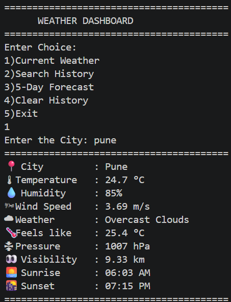
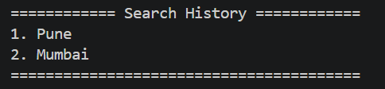
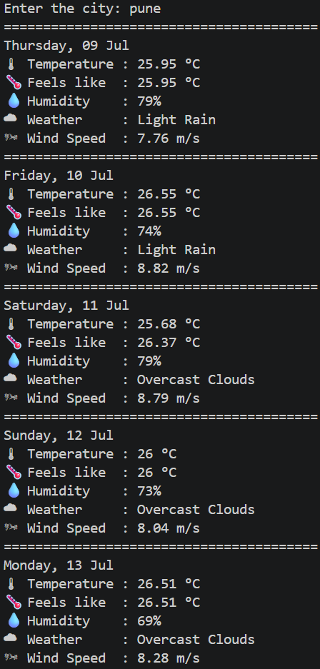
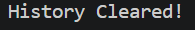

# 🌦️ Weather Dashboard

A command-line Weather Dashboard built with Python that fetches real-time weather information and a 5-day forecast using the OpenWeatherMap API.

## ✨ Features

- 🌡️ Current weather information
- 📅 5-day weather forecast
- 🌅 Sunrise & Sunset timings
- 🌡️ Feels Like temperature
- 💧 Humidity
- 🌬️ Wind Speed
- 👀 Visibility
- 📊 Atmospheric Pressure
- 🔍 Search History
- 💾 Persistent search history using JSON
- 🔐 Secure API key using `.env`
- ❌ Handles invalid city names gracefully
- 🧹 Clear search history option

---

## 🛠️ Technologies Used

- Python 3
- Requests
- OpenWeatherMap API
- Python Dotenv
- JSON

---

## 📂 Project Structure

```
Weather-Dashboard/
│
├── Main.py
├── history.json
├── .env              # Not included in GitHub
├── .gitignore
└── README.md
```

---

## 🚀 Installation

### 1. Clone the repository

```bash
git clone https://github.com/your-username/Weather-Dashboard.git
```

### 2. Navigate to the project

```bash
cd Weather-Dashboard
```

### 3. Install dependencies

```bash
pip install requests python-dotenv
```

### 4. Create a `.env` file

Create a file named `.env` in the project folder and add:

```env
API_KEY=YOUR_OPENWEATHERMAP_API_KEY
```

You can get a free API key from:

https://openweathermap.org/api

---

## ▶️ Run the program

```bash
python Main.py
```

---

## 📸 Features Preview

### Current Weather






---

## 📖 What I Learned

While building this project, I learned:

- Working with REST APIs
- Sending HTTP requests using `requests`
- Parsing JSON responses
- Environment variables using `.env`
- File handling in Python
- Saving and loading JSON data
- Error handling
- Working with dates and timestamps
- Writing modular functions
- Building menu-driven CLI applications

---

## 🔮 Future Improvements

- Weather icons
- Hourly forecast
- Multiple unit support (°C / °F)
- Colored terminal output
- Automatic location detection
- GUI version using Tkinter or PyQt
- Flask web version

---

Made with ❤️ using Python.